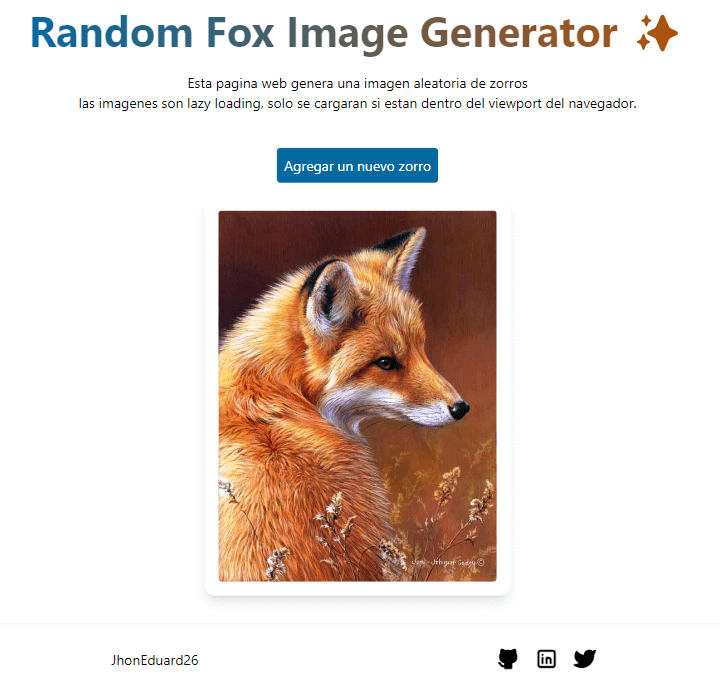

# Random Fox Image

Esta pagina web genera una imagen aleatoria de un zorro, las imagenes son lazy loading, solo se cargaran si estan dentro del viewport del navegador.

## Table of contents

- [Overview](#overview)
  - [Screenshot](#screenshot)
  - [Links](#links)
- [My process](#my-process)
  - [Built with](#built-with)
- [Author](#author)

## Overview

### Screenshot

### Links

- Solution URL: [GitHub](https://github.com/JhonEduard26/random-foxes)
- Live Site URL: [GitHub Pages](https://jhoneduard26.github.io/ecommerce-product-page/)

## My process

### Built with

- NextJS
- Typescript
- Tailwindcss
- Npm

## Author

- Website - [Jhon Eduard Bocanegra](https://github.com/JhonEduard26)
- Twitter - [@JhonBocanegra26](https://twitter.com/JhonBocanegra26)
